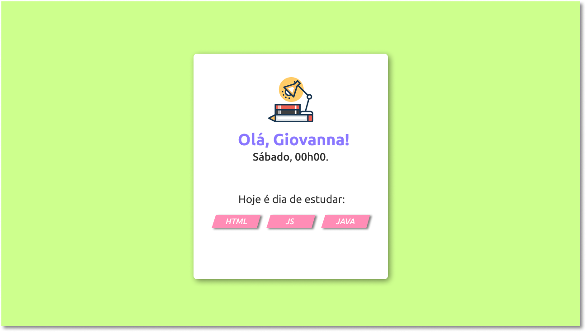

# STUDY LIST USING JAVASCRIPT

### Using learned concepts about JavaScript to develop a simple JS app that get the current date from system in order to show to the user a list of what he is supposed to study on that day. 

<h1 align="center">Page Project</h1>

  

